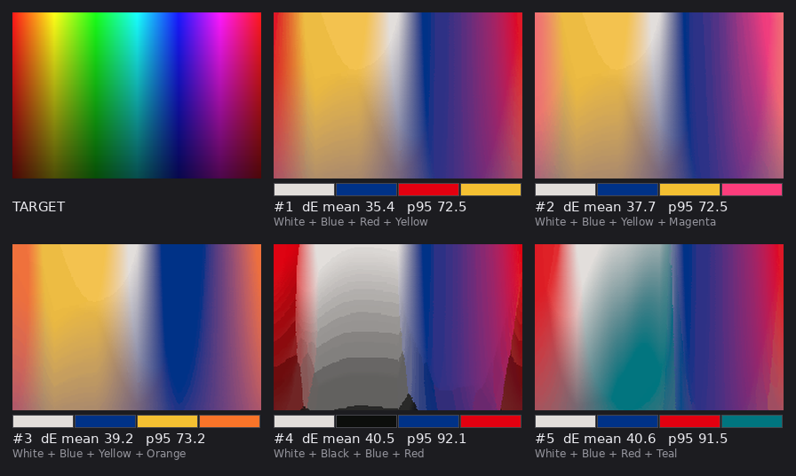
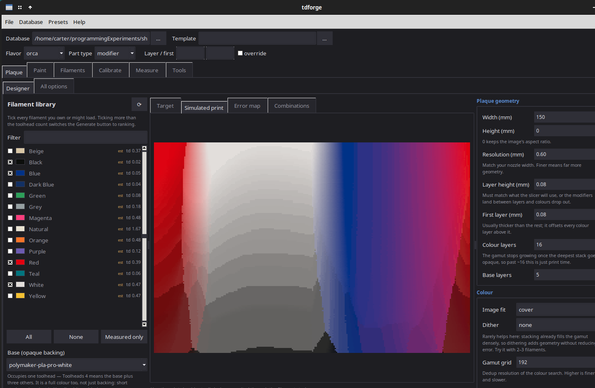
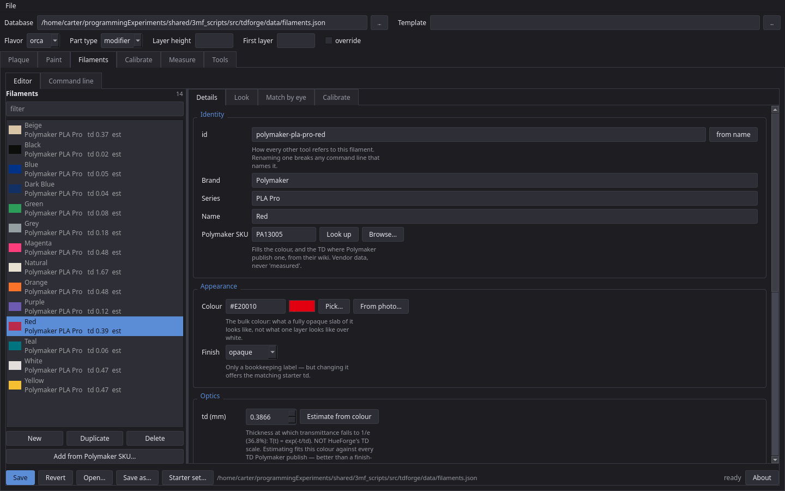
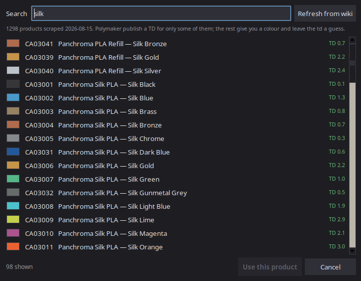
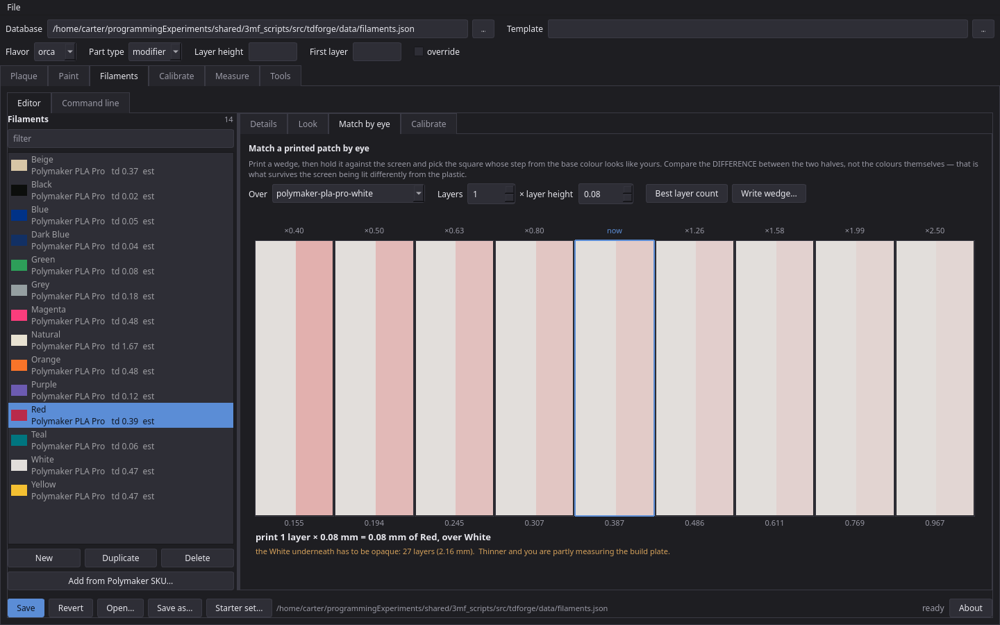
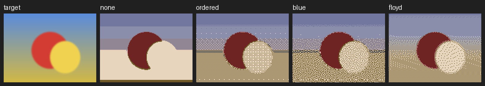

# stackforge

Flat, full-colour prints from a handful of filaments on a **4-independent-toolhead printer**
(built and tested on a FlashForge Creator 5). Where HueForge encodes an image in a *height map*
with one global filament order, stackforge gives **every pixel its own filament stack** and
prints the plaque at constant thickness. The question it answers: *given these spools and this
image, which stacks reproduce each pixel, and which four spools should I load?*



```
image ──► gamut search ──► per-pixel stack ──► 3MF (modifier volumes per layer) ──► slicer
            ▲                                          ▲
   filamentdb (colour + td per filament)        --template (your slicer's own 3MF)
            ▲
   calibrate.py (print wedges, fit td)
```

## Quick start

```sh
pip install -e .   # the command-line tools; add ".[gui]" for the Qt GUI
stackforge docs/stackforge_target.png --base polymaker-pla-pro-white \
    --filaments polymaker-pla-pro-white,polymaker-pla-pro-blue,polymaker-pla-pro-red,polymaker-pla-pro-yellow \
    --width 60 --base-layers 27 --preview sim.png -o plaque.3mf
```

Then pass `--template your_export.3mf` for Flash Studio / Orca-family slicers (see *Caveats*).
Always look at `--preview` before slicing. Run `pip install -e ".[dev]" && pytest` for the tests (`python3 -m unittest discover -s tests` also works).

## One GUI for everything

```sh
pip install -e ".[gui]"   # once; adds PySide6
tdforge-gui [image.png] # or: python -m tdforge.gui.qt.app
```

Start on the **Plaque** tab: open an image, tick the filaments you own (the list is your
database), press **Generate**, then **Export 3MF**. Set your slicer project as the *Template*
in the bar at the top and the layer height follows it.

`tdforge-gui` opens a single window over every tool here: Plaque (the stackforge designer, plus
an *All options* form), Paint (topdeco / surfacecolor), Filaments (the library editor, plus the
filamentdb / polymaker forms), Calibrate, Measure (munki, with a terminal) and Tools.



The forms are generated from each CLI's `argparse` definition, so a new flag appears with no
GUI change, and every run is the CLI as a subprocess (`python -m tdforge.tools.<tool>`), so the
GUI and the command line cannot diverge. Each form shows the equivalent shell command.
The bar across the top holds the project: database, template, flavor, part type and the layer
height / first layer, which are read from the template unless overridden. Settings and per-tool
presets live in `~/.config/tdforge/`. Ctrl+Enter runs the visible form, Esc cancels it.

## Caveats up front

- **Verified:** output loads as a project in Flash Studio 1.7.x with four parts on extruders 1-4.
- **Verified (headless slice, 2026-09-30):** Flash Studio honours extruder overrides on *modifier*
  volumes. `tests/test_slice.py` re-checks this on every test run where Flash Studio is installed
  (skip it with `TDFORGE_SKIP_SLICER=1`; locations via `FLASHSTUDIO_RUN` / `FLASHSTUDIO_TEMPLATE`).
  If colours are wrong in your slicer, try `--part-type part`.
- The optical model is single-pass alpha-over with per-filament `td`; accuracy depends on
  calibrated `td` values (`calibrate.py`). Shipped `filaments.json` (in `src/tdforge/data/`) values are mostly estimates.
- The base must be opaque (`--base-layers`); stackforge warns when it is not.
- Slice at exactly the `--layer-height` you generated with.

## Repository layout

Everything lives in the `tdforge` package under `src/tdforge/` (`core/` libraries, `tools/` CLIs,
`gui/`); `pip install -e .` puts one console script per tool on PATH, and
`python -m tdforge.tools.<tool>` also works. The rest of this repo is the toolchain stackforge stands on. Tool changes are assumed cheap,
so nothing here tries to minimize them.

| tool | what it does |
|---|---|
| `filamentdb` (`core/`) | filament colors + optical properties, grown over time |
| `gui/filaments/` | the library editor (details, look, match by eye, calibrate) |
| `polymaker` (`tools/`) | look a Polymaker SKU up in their published hex/TD table |
| `calibrate` (`tools/`) | step-wedge generator and td/color fitter |
| `topdeco` (`tools/`) | project an image onto the top-visible surface of any 3MF or GLB |
| `surfacecolor` (`tools/`) | colour a 3MF or GLB anywhere on its surface: the GLB's own colours, a wrapped image, or a pattern |
| `munki` (`tools/`) | measure wedges, plaques and chip transmission with a ColorMunki / ArgyllCMS |
| `halftone_compare` (`tools/`) | score stackforge's dither modes by blurred dE |
| `make_fixture` (`tools/`) | generate `fabric.3mf` and `badge.3mf` test models |
| `stackforge` (`tools/`) | flat full-color plaques from per-pixel filament stacks |
| `gui/` | the Qt GUI (`tdforge-gui`): host window (`app.py`), generated forms (`form.py`, `panel.py`), pickers, one module per tab in `tabs/`, plaque designer in `tabs/plaque.py` |
| `data/` | shipped `filaments.json` and `polymaker_catalog.json`; a copy in the working directory wins |
| `core/td3mf.py`, `core/tdcolor.py` | shared 3MF I/O and color math |
| `gui/theme.py` | the dark theme and small layout helpers |
| `gui/argform/` | form specs generated from each tool's `build_parser()`; no GUI toolkit needed |
| `core/optics.py` | what layers of a filament look like over a base (previews, best layer count) |

`surfacecolor.py` is built to the first three steps of `docs/plans/surfacecolor.md`
(patterns, wrapped images, shell masking); the interactive painting window is not.

Requires `numpy`, `Pillow`, `scipy`; `tdforge-gui` also needs `PySide6` (the `gui` extra).
`polymaker.py` is stdlib only.

---

## filamentdb.py

One plain JSON file (`./filaments.json` if present, else the copy shipped in the package; or `$FILAMENT_DB`) so it
diffs cleanly in git and you can hand-edit it. Every entry records where its
numbers came from, so estimated placeholders never get mistaken for measured
values — `list` dims anything unmeasured. `provenance` runs
`measured` (a wedge, read with an instrument) → `matched` (a wedge, compared by
eye, good to ~±15%) → `vendor` (published by the manufacturer) → `estimated`
(a guess). Only the first is trusted without a warning.

```sh
filamentdb seed                 # starter Polymaker PLA Pro set
filamentdb list
filamentdb add --name Teal --color "#00757F" --td 0.13
filamentdb show teal --layer-height 0.08
filamentdb set teal --td 0.128 --provenance measured
filamentdb import-sku CA02001    # colour + TD from Polymaker
```

### Transmission distance

`td` is the thickness in mm at which transmittance falls to 1/e (36.8%):
`T(t) = exp(-t / td)`. Optional `td_rgb` gives per-channel values.

**This is not HueForge's TD scale**, which is closer to "thickness to
opacity". Use `import-hueforge` (divides by ~4.6) rather than pasting values
across.

The seeded defaults are finish-based guesses chosen so pigmented PLA goes
opaque in ~0.6 mm (~8 layers at 0.08 mm). That target matters more than it
looks: the whole stacking technique lives on *partial* transmission. Too
opaque and the reachable gamut collapses to the filament colors with nothing
in between; too transmissive and the base leaks through even at full depth, so
saturated darks become unreachable.

---

## Filaments tab (tdforge-gui)

```sh
tdforge-gui   # then the Filaments tab
```

The database is the weakest link in everything else here — stackforge's colour
maths is only ever as good as the `td` and colour it is handed. The CLI can
already write those numbers; what it cannot do is show you what they *mean*.
That is what this is for.



- **Library** down the left with swatches, live filter, and `est` on anything
  unmeasured. New / Duplicate / Delete, and *Starter set…* for a
  fresh brand and series.
- **Details** — every field, with the colour settable by hex, by picker, or by
  clicking a photo of a printed swatch (it averages a 7×7 patch, because print
  texture makes a single pixel meaningless). Changing the finish offers that
  finish's starter td, but never over a measured entry. A HueForge TD box
  converts rather than letting the wrong scale in, and a **Polymaker SKU** box
  fills the whole entry from their published table — see
  [polymaker.py](#polymakerpy).
- **Look** — the payoff. N layers of the selected filament composited over
  white *and* over black with the same optical model stackforge uses, plus the
  transmittance table and the depth at which it goes opaque. A td that is wrong
  by a factor of two is obvious here and invisible in a JSON file.
- **Match by eye** — no instrument needed: pick the candidate `td` whose
  patch-against-base step looks like your printed one. See
  [matching by eye](#matching-by-eye-with-no-instrument).
- **Calibrate** — the whole loop in one place: write the step-wedge 3MF, print
  it, type in the patches (or sample them from a photo of the wedge), fit, read
  the per-step residuals, and commit the result to the entry.

Nothing touches disk until Save; the Editor tab carries a dot while there
are unsaved edits, and Save refuses the whole file if any entry has an unparseable
colour or a non-positive td.

### It refuses the same bad fits the CLI does

Applying a fit sets `provenance` to `measured` and stamps the date and layer
height, so an entry can only earn that label by being measured. And a fit from
a single low-contrast wedge cannot be applied at all — if the wedge spans less
than dE 25 end to end, td and colour are trading off against each other and the
solver will report a tight residual on a badly wrong answer. The report says so
in red and the Apply button stays disabled until you fill in Wedge B over a
contrasting base.

Checked against synthetic wedges: a translucent with a true td of 0.90 fits to
0.865 from one white-base wedge (blocked, correctly — the wedge spans dE 5), and
to **0.8978** once the black-base wedge is added. A teal with true td 0.30 and
colour `#227788` comes back as 0.2997 / `#237788`.

---

## polymaker.py

Polymaker publish a HEX code and a TD for most of their catalogue:
[wiki.polymaker.com › Hex Codes and Transmission Distances][poly]. This scrapes
that page once into `polymaker_catalog.json` (the packaged copy unless there is one in the
working directory, or `$POLYMAKER_CATALOG`) and reads from there afterwards,
so lookups are instant, work offline, and diff in git the way the filament
database does.

[poly]: https://wiki.polymaker.com/polymaker-products/more-about-our-products/hex-codes-and-transmission-distances

```sh
polymaker refresh              # re-scrape (needs network; retries, and leaves the cache alone on failure)
polymaker lookup CA02001
polymaker search silk blue
polymaker import CA02001 --write

filamentdb import-sku CA02001  # same thing, from the db tool
```

```
CA02001    Panchroma Translucent PLA — Translucent Cyan
  hex #08ABFB
  TD 8.0 (Polymaker scale)  ->  td 1.7391 mm here
```

SKUs are matched case-insensitively and ignoring dashes and spaces, and a near
miss gets a *did you mean* list. Imports set `brand`, `series`, `name`,
`color`, `finish`, the new `sku` field, and a note recording where the numbers
came from and when.

### Their TD is not this database's td

The wiki defines TD as "the approximate thickness of solid plastic (in
millimeters) that light can penetrate before it is effectively blocked" — the
HueForge scale. This database stores the **1/e** thickness. Reading "effectively
blocked" as 1% transmission puts them `ln(100)` = 4.6 apart, so everything
converts on the way in (`filamentdb.hueforge_td`) and no raw wiki TD is ever
written into a `td` field. Translucent Cyan's TD 8 becomes td 1.739 mm.

### What the table does and does not have

Of the 1,298 products scraped in August 2026:

| | |
|---|---|
| 1,141 | have a HEX code |
| 384 | have a TD — **most SKUs give you a colour and nothing else** |
| 46 | are dual-colour and list two HEX codes |

So a lot of imports fill in the colour and leave the td a finish-based guess.
Those entries stay `provenance: estimated` and say why in their notes — calling
them `vendor` would be a lie about the number that matters most. Only a SKU with
both becomes `vendor`. Nothing here ever writes `measured`; that is what
`calibrate.py` is for.

Dual-colour filaments are refused outright, with their two hex codes in the
error, because the optical model assumes one bulk colour per filament. SKUs with
no published HEX are refused too.

Importing over an entry that is already `measured` needs
`--overwrite-measured`: a printed wedge beats a vendor number, and clobbering it
by accident would be a real loss.

### From the GUI

the Filaments tab has a **Polymaker SKU** box on the Details tab (type it,
press Look up) and *Add from Polymaker SKU…* for browsing the catalogue by
colour with swatches and TDs:



Search is ranked — an exact colour-name match wins, then importable entries,
then ones with a published TD — because "silk blue" otherwise buries the
filament actually called Silk Blue under every Dual Silk whose name mentions
blue. *Refresh from wiki* re-scrapes on a worker thread.

### Guessing a td from colour

Most SKUs have no published TD, so `guess-td` learns one from the 384 that do:

```sh
polymaker guess-td --all           # dry run over the database
polymaker guess-td teal --write
```

It fits log(TD) against L\*a\*b\* within a finish group, and **picks between that
regression and the group's flat median by leave-one-out**, per group, rather
than assuming which is better — because it varies:

| group | n | winner | typical error |
|---|---|---|---|
| pigmented | 148 | colour regression | ×1.6 |
| silk | 24 | colour regression | ×1.5 |
| translucent | 18 | group median | ×1.4 |
| glow | 8 | group median | ×1.2 |

Training pairs are deduplicated on (hex, TD) first — the rebrand left the same
spool in the table twice, and counting it twice would flatter the accuracy.
Estimates are clamped to the range actually observed for the group, and the
entry stays `estimated` with a note recording the method and its error.

**How much this buys you.** Planning a plaque with the wrong td and then
compositing the stacks it chose with the true optics, over an in-gamut target:

| td accuracy | resulting print |
|---|---|
| exact | dE 0.3 |
| ×1.5 out (colour estimate) | dE 5–13 |
| ×3.1 out (one flat guess for everything) | dE 8–30 |

So the estimator roughly halves the error, and a wedge is still worth an order
of magnitude more than either.

**The preview cannot see this error.** It composites with the same wrong td it
planned with, so it is self-consistent and confident: in those runs the preview
claimed dE 1.6–4.0 while the actual print was dE 4.6–13.2. A clean-looking
preview says nothing about whether the td is right.

### Their table disagrees with itself

Worth knowing before you trust any single number: 21 pairs of entries share a
colour to within dE 2 and disagree on TD by more than 1.8×. `#A4D0DF` is TD
**1.8** as Panchroma Matte Pastel Ice and TD **0.1** as PolyTerra Matte Pastel
Ice — the same spool under its old and new name, 18× apart. Some of that is
real (finish changes transmission), some is measurement noise, and it caps how
well any colour-based estimate can ever do.

### When it breaks

The wiki is a GitBook page, so this parses `role="row"` / `role="cell"` markup
— fragile by nature. `refresh` refuses to overwrite a good cache with a parse
that collapses to fewer than 200 rows, and points at the selectors to fix. The
cached JSON keeps working in the meantime.

---

## calibrate.py

Turns estimated entries into measured ones. Every step below is also available
inside the Filaments tab, which is usually the easier way to run it — same
maths, same refusals, but you can see the residuals per step.

```sh
# 1. print this
calibrate wedge --filament teal --base white -o wedge_teal.3mf

# 2. read the patches, then fit
calibrate fit --filament teal --base "#F4F5F0" \
    --measured "#BAC8C7,#8CA8AB,..." --write
```

`--from-image shot.png` samples patches from a photo instead of hand-entered
hex. A spectrophotometer is ideal; a phone photo under flat indirect daylight
with a white card in frame, white-balanced against the card, works well enough.

### Print two wedges, over contrasting bases

**A good fit does not imply a trustworthy td.** If the filament's own color is
close to the background, every step looks nearly the same, and td trades off
against color — the solver returns a tight residual on a badly wrong answer.
On synthetic data a translucent filament with a true td of 0.90 fit to 1.72
with a convincing dE of 0.9 from a single light-base wedge.

A second wedge over a contrasting base breaks the degeneracy, because both
must be explained by one color and one td. Same data, joint fit: **0.9003**.

```sh
calibrate fit --filament natural \
    --base  "#F4F5F0" --measured  "..." \
    --base2 "#1A1A1C" --measured2 "..." --write
```

The tool warns when a single wedge spans less than dE 25 end to end, and
refuses `--write` in that case.

### Matching by eye, with no instrument

If you have no spectrophotometer and no white card, you can still do far better
than a guess: print patches, then compare them against the model's prediction
on screen. the Filaments tab has a **Match by eye** tab for exactly this.



It states plainly what to print — *"print 8 layers × 0.08 mm = 0.64 mm of Red,
over White"* — because a layer count means nothing without the layer height it
was counted at, and the model only cares about the millimetres. Change the
layer height and the recommended count changes with it, holding the physical
thickness roughly constant (8 × 0.08 mm and 4 × 0.20 mm are the same test). It
also names the base thickness needed for the patch to be measuring filament
rather than build plate.

It offers nine candidate `td` values spanning ×0.4 to ×2.5 and draws each one
as **base beside patch**. The judgement asked for is which pair has the same
*step* as your print — a contrast comparison, not an absolute colour one. That
matters: nobody can name a colour by eye, but everybody can see which of two
pairs differs more, and comparing steps is what makes the screen's white point
and the room's lighting largely cancel. Picking a square sets `td` and marks
the entry `matched`.

**The useful thickness is per filament, and it is not obvious.** *Best layer
count* works it out by asking where a 1.6× `td` error moves the patch furthest:

| filament | best test (at 0.08 mm layers) | a 1.6× error shows as | pins td to |
|---|---|---|---|
| Black | **1 layer — 0.08 mm** over white | dE 13.9 | ±16% |
| Blue | 1 layer — 0.08 mm over white | dE 16.6 | ±15% |
| Green, Purple | 2 layers — 0.16 mm over white | dE 12–13 | ±20% |
| Red, Yellow, Magenta | 6–8 layers — 0.48–0.64 mm over white | dE 13–20 | ±13–18% |
| Orange | 12 layers — 0.96 mm over white | dE 15.2 | ±16% |
| White | 3 layers — 0.24 mm over **black** | dE 9.0 | ±30% |
| Natural | 8 layers — 0.64 mm over black | — | ±30% |
| Beige, Grey | 1–2 layers over black | dE 3–4 | ±32–40%, weak |

One layer is the *sharpest* test for an opaque filament and nearly useless for
a translucent one — black is already opaque at a single layer, while natural
barely absorbs anything until it is millimetres thick. Over white, beige and
natural show almost nothing at any thickness; they need a dark base.

Against the ±60% a colour-based estimate gives, ±15% is a real gain — the
simulations above put that at roughly dE 3–4 in the finished plaque instead of
dE 5–13.

### One plate, three filaments

`wedge` takes a comma-separated list and puts one staircase row per filament
over a shared base, each on its own extruder — so a four-head machine
calibrates three filaments per print:

```sh
calibrate wedge --filament black,blue,red --base white \
    -o wedge.3mf --steps 8 --base-layers 27
```

Mind `--base-layers`: the patches are only measuring the filament if the base
underneath them is opaque, and white needs ~27 layers to get there. The command
warns when it does not.

### Per-channel td

Pigmented filaments often need it — a red that passes red but blocks green and
blue cannot be described by one number. Synthetic red with true
`[0.45, 0.11, 0.09]`: scalar fit gives dE 19.7 and flags itself as poor;
`--per-channel` recovers `[0.4482, 0.11, 0.09]`. If a scalar fit reports a bad
residual on clean measurements, that's the signal to switch.

---

## topdeco.py

Renders a top-down z-buffer, samples an image across the footprint, quantizes
to your filaments, and emits one modifier volume per filament hugging the
visible top surface. Only the top `--depth` mm change color; original geometry
is never altered.

Because the boxes follow the z-buffer rather than sitting at a fixed height,
this works on arbitrary geometry — a flat chainmail sheet, a domed badge, and a
terrain tile all get the image laid over their real top surface.

```sh
topdeco fabric.3mf logo.png -o out.3mf \
    --filaments white,black,blue,red --depth 0.6 --preview prev.png
```

| flag | meaning |
|---|---|
| `--filaments` / `--palette` | from the database, or raw hex |
| `--resolution` | mm per sample, also box granularity |
| `--depth` | mm below the surface the color reaches |
| `--dither` | `none` / `ordered` / `floyd` — worth it here, the palette is flat |
| `--fit`, `--rotate`, `--flip`, `--region` | image placement |
| `--flavor` | `orca` (default) or `prusa` |
| `--part-type` | `modifier` (default) or `part` |
| `--preview` | PNG of exactly what will be painted |

On chainmail the gaps between tiles mask out automatically, giving a mosaic at
tile resolution. 159 mm sheet at 0.4 mm runs in about half a second.

---

## stackforge.py

HueForge builds a **height map**: one global filament order for the whole
print, with a pixel's color decided purely by stack height there. That exists
because on a single-hotend MMU every swap is a global event.

With independent toolheads, swaps are cheap — so this drops the height map.
Every pixel gets its **own** stack, and the plaque comes out **flat**. Color is
encoded in vertical composition, so there's no surface topography to catch
raking light.

```sh
stackforge photo.jpg -o plaque.3mf \
    --filaments white,black,blue,red,yellow --base white \
    --width 150 --layer-height 0.08 --max-layers 16 \
    --preview sim.png --gamut-preview check.png
```

### Optical model

Layers composite bottom-up in linear light. Adding a layer of filament *f*
over an existing color *C*: `T = exp(-h/td_f)`, then `C' = C·T + color_f·(1-T)`
— alpha-over with `α = 1-T`. Single-pass: it ignores light scattering back up
through the stack a second time, the same approximation HueForge uses. It
holds up well for pigmented PLA.

The gamut is built by breadth-first expansion, deduplicated on a grid over the
sRGB encoding (a linear-light grid lumped L\* 0–5 into one cell). A layer that
moves the colour by less than one cell is still followed, so translucent
filaments keep accumulating. The state is just the composited color — what's underneath stops mattering
once obscured — so the search stays 3-dimensional however deep it goes.

Short stacks pad at the **bottom** with base filament, which is optically
identical to the base plate. That's what keeps every pixel the same height
while allowing different effective depths.

### Choosing which filaments to load

List more filaments than you have toolheads and it compares every subset that
fits, so you can see which loadout suits the image before committing to a
print. Ranking turns on automatically; `-o` is not needed.

```sh
stackforge photo.jpg --base white \
    --filaments white,black,blue,red,yellow,teal,orange,magenta \
    --slots 4 --top 5 --rank-sheet combos.png
```

Prints a ranked table and writes a contact sheet — target first, then the best
few rendered with their filament swatches and dE. Then re-run with the winning
`--filaments` and `-o` to produce the plaque.

**The base counts as one of your toolheads.** `--slots 4` means four spools
total: the base plus three others, never five. A `--base` outside `--filaments`
is rejected rather than quietly added. The base is a full color as well as the
backing — short stacks pad against it at the bottom, so it does double duty
without costing an extra slot.

Scoring weights each distinct colour of the image by how many pixels have it,
so it is exact and repeatable (a random sample of 4000 pixels flipped the winner
between seeds when the top two were 0.04 dE apart). Images with more than
`--rank-samples` distinct colours (default 20000) are binned to fit. With
`--dither ordered/blue` the two-stack mix is scored, since that is what prints;
the contact sheet is rendered with the same dither. 35 combinations of 8
filaments take about 50 s. The base is held fixed in every subset, so with N filaments and S
slots there are `C(N-1, S-1)` combinations — 8 filaments and 4 slots gives
`C(7,3)` = 35.

`--rank-by p95` optimizes worst-case error instead of average — worth it when
a few badly-wrong regions bother you more than a slight overall shift.
`--no-rank` skips it and uses the base plus the first `--slots`-1 others as listed.

As a sanity check: on `docs/stackforge_target.png` (a full hue sweep) the
ranker's top two are white + blue + red + yellow and white + blue + yellow +
magenta — subtractive-ish primaries, found without being told about them.

### GUI

```sh
tdforge-gui [image.jpg]   # the Plaque tab
```

Every CLI option, plus the things a GUI is genuinely better at: seeing the
simulated print beside the target while you turn knobs, and picking a loadout
by looking at renders instead of reading a table.

- **Filament library** down the left with swatches; unmeasured entries are
  dimmed and tagged `est`. Tick more than the toolhead count and the Generate
  button becomes **Rank combinations**.
- **Four tabs**: target, simulated print, error map, and the combination
  contact sheet.
- After a ranking it offers to select the winning filaments and generate
  straight away.
- Solves run on a worker thread with a progress bar and a working Cancel, so
  the window never locks up.
- Export reports the load order (T1…T4) and the exact layer height to slice at,
  and asks first if the image, filaments or settings changed since Generate.
- The base is always T1 in the GUI; use the CLI to put it on another toolhead.
- Edits made on the Filaments tab are picked up here when you switch back (the list reloads,
  keeping whatever was already ticked).

### Dithering

`--dither blue` (blue-noise screen), `ordered` (Bayer) and `floyd` all try to buy accuracy by
mixing two stacks per pixel side by side. `halftone_compare.py` scores them on dE after a
Gaussian blur that stands in for the eye, since per-pixel dE punishes any dither unfairly.



Measured on a smooth test scene with five filaments: with **1-2 layers** blue and ordered cut
blurred dE from 27.7 to about 25.7; at 4 layers the gain shrinks to under 1. With deep stacks
it depends on the scene: under 0.1 on this one, about 0.7–1.1 on saturated hue sweeps whose
targets fall outside the gamut. Blue and ordered score alike on dE; blue trades Bayer's
crosshatch for grain, which is the reason to prefer it. `floyd` beat `none` at 1-2 layers but
trailed blue/ordered, and was worse than `none` from 4 layers up.

**Those are simulated gains; the slicer takes most of them back.** A dither is made of
one-pixel features, and Flash Studio 1.7.8 gives each modifier region its own walls and
does not extrude features one 0.4 mm pixel wide (see *Slicing*). Dithered plaques are
11–33% one-pixel features. Until that is solved, prefer `--dither none`.

### Notes from testing

- **The gamut saturates.** With 4–5 filaments at 0.08 mm it stops growing
  around 16 layers, once the deepest stack goes opaque. `--max-layers 20` adds
  time and no color.
- **Dither only shallow stacks.** With 12+ layers the gamut is already dense
  (~215k colours for 5 filaments at 16 layers) and blue/ordered gain little;
  see *Dithering*, including why the slicer undoes it. It *does* matter in
  `topdeco`, where the palette is flat.
- **Residual error is gamut, not solver.** Feeding a rendered result back in
  gives mean dE 0.1. If `--gamut-preview` shows red regions, those colors are
  genuinely unreachable with that filament set — add a filament, don't tweak
  settings.
- **Geometry gets big.** A 120 mm plaque at 0.4 mm / 16 layers is ~2M
  triangles and ~15 MB. Coarsen `--resolution` or drop `--dither` if the
  slicer struggles.

### Solid infill is required, not optional

The optical model treats every colour layer as a continuous film. Stock
profiles make only the top shell solid — the Creator 5 profile is
`top_shell_layers 5` / `top_shell_thickness 1 mm` over `sparse_infill_density
15%` — so on a 16-layer stack roughly eleven layers would print as sparse grid
and the colour maths would not describe the object at all.

`stackforge` therefore bakes `sparse_infill_density: 100%` into the output
profile, and pins `infill_combination: 0` so neighbouring colour layers are
never merged into one extrusion. `--no-force-solid` opts out if your profile is
already fully solid.

`topdeco` does not change infill (it paints someone else's model), but it warns
when `--depth` reaches below the profile's solid top shell, where paint would
land on a lattice rather than a surface.

### The base has to actually be opaque

The gamut starts from "the base is an opaque backing", and with a realistic td
that is not free. White is far more transmissive than it looks: the shipped
Polymaker PLA Pro White (`td` 0.467 mm, estimated) passes **42%** through the
default 5 base layers (0.40 mm), and the print picks up whatever is underneath;
stackforge asks for 27 (2.16 mm). Black at `td` 0.022 is opaque in 2 layers.

What `td` means matters here. `calibrate.py` fits it to *reflected* light,
which crosses each layer twice, so it is an effective value; `munki.py
measure-transmission` measures single-pass `td`, which for a clear absorber is
about twice as large. stackforge uses the reflectance kind.

`stackforge` now warns when the base passes more than 1% and tells you the
layer count that would fix it; the GUI's estimate panel shows the same. The old
flat `td` 0.13 put white at 4.6% through 5 layers, which is why this never came
up before.

### Bottom layers come out base-coloured, and that is fine

Short stacks pad downward with base filament, so the deepest colour layers are
legitimately uniform base. Those are now **trimmed automatically** — padding
sitting on a base-filament plate is optically identical to no padding at all,
so dropping it is free. A 16-layer stack that only needs 12 prints 12.

A solid block of base colour at the bottom is by design. *Alternating* or
periodic base layers are the layer-grid bug described above.

### Slicing

**Layer geometry must match the profile that will slice it**, or colours drop
out. Boxes sit in the middle half of each layer — Slic3r-family slicers sample
at each layer's mid-height, so a correctly aligned box is always hit — but that
tolerance cannot survive a wrong spacing or a wrong starting offset.

Two things set that grid, and both are read from `--template` automatically
**and written back into the output**:

- `layer_height` — the spacing.
- `initial_layer_print_height` — the first layer is usually thicker, and it
  offsets **every** layer above it. A 5-layer base is
  `first + 4 × layer`, not `5 × layer`.

The heights are baked into the output's `project_settings.config`, and the layer
height is also written as a per-object override (Orca drops project values
whose preset name matches a system preset; per-object ones survive). That holds
when you override with `--layer-height` / `--first-layer-height` too, which
rewrites the profile to match rather than leaving a silent conflict. The first
layer has no per-object form, so it relies on the profile rewrite. A height
outside the profile's own `min_layer_height`/`max_layer_height` is warned about.

**Features one pixel wide do not print at 0.4 mm.** Sliced headlessly in Flash
Studio 1.7.8 and compared pixel by pixel with the design, every extruded pixel
had the designed tool, but 5–9% of colour pixels got no plastic at
`--resolution 0.4`: each modifier region gets its own walls, and a region one
nozzle-width across is dropped. At 0.6 mm the same plaque lost 0.1%, so 0.6 is
the default and stackforge warns below it.

**The prime tower is moved in if it would run off the bed.** A single-colour
template never grew a tower, so its saved position can be too close to the back
edge; Flash Studio then refuses to slice ("G-code in unprintable area").

Getting this wrong has a distinctive symptom: colour appears on some layers and
not others in a repeating pattern, because the boxes beat against the real layer
grid. Note that a *solid block* of base-coloured layers at the bottom is not the
same thing — short stacks pad downward with base filament by design.

---

## Caveats — verify before a long print

- **Always pass `--template` for Flash Studio.** It fixes two things at once.

  *The version gate.* Orca-derived slicers parse the `Application` metadata
  into a generator version and compare it against the **running** slicer. Too
  old, and they show *"generated by an old OrcaSlicer version, loading geometry
  data only"* and silently discard `model_settings.config` -- losing every part
  and extruder assignment. The string must be at least as new as the installed
  build, so the writer reads it out of the template rather than hardcoding one.
  Do not copy a version from FlashForge's own bundled calibration 3MFs: they
  say `BambuStudio-02.00.02.01` (= 2.0.2.1) while Flash Studio 1.7.x is 2.3.2,
  so a file claiming the bundled version reads as stale and fails.

  *The project settings.* Opening as a project needs
  `Metadata/project_settings.config`, a 600-key printer profile. That cannot be
  synthesized without inventing a printer, so it is carried over verbatim along
  with `slice_info.config`. Anything describing geometry or a plate
  (`cut_information.xml`, plate thumbnails) is deliberately left behind: it
  would still point at the template's objects, and a stale reference breaks the
  load more reliably than a missing one. `filament_colour` is patched to the
  filaments actually used, so the slicer previews the right colours.

- **Give the template as many filament slots as you print with.** Set all four
  up in Flash Studio before exporting it. Dozens of per-filament arrays in the
  profile are indexed in lockstep (type, temperature, flow, retraction), so the
  writer will not grow `filament_colour` by itself, and it refuses to write the
  file: sliced, the missing extruders collapse onto extruder 1 and those colours
  print in the base.

- Confirmed working against Flash Studio 1.7.x with a Creator 5 profile: loads
  as a project, four parts on extruders 1-4, and (sliced with Flash Studio 1.7.8
  from the command line) the extruder overrides on modifier volumes are honoured.

- `--part-type part` gives real overlapping solids instead of modifiers.
- Output 3MFs are regenerated clean: transforms are baked to world space and
  slicer settings in the *input model* (topdeco/surfacecolor) are **not**
  carried over; `--template` supplies the profile.
- Always check `--preview` before slicing. It costs nothing.

## surfacecolor.py

**Realistic colour from a GLB.** Give it a `.glb`/`.gltf` and it reads the model's own colours
(base-colour texture with its UVs, vertex colours, material colour), quantises them to your
filaments with an ordered dither, and writes a printable 3MF:

```sh
surfacecolor model.glb -o out.3mf --filaments white,black,blue,red --template my_profile.3mf
surfacecolor model.glb -o out.3mf --palette "#e2dedb,#0c0e0c,#003287,#e20010" --scale-to 60
```

glTF is Y-up metres; it is rotated to Z-up and scaled to millimetres (`--scale-to MM` sets the
largest dimension instead), put on z=0 and centred on the bed from `--template`. Compressed
files (Draco, meshopt, KTX2) are refused with a message; re-export without compression.
`--dither off` gives plain nearest-filament; the run prints a mean dE (simulated, not
measured). Dithering is made of one-voxel features, so keep `--resolution` at 0.6 mm or more
(the default 0.8 is fine). The result is only as good as your palette: a texture with green in it
needs a green-ish filament. `make-fixture` writes `globe.glb` to try this on. The Paint tab's
*Realistic colour* mode is this path.

Everything below also applies to GLB input; the decorative patterns need no colour data.

Colours an existing 3D model anywhere on its surface without UVs: it voxelises
the model on the slicer's layer grid, evaluates a pattern at every voxel within
`--depth` mm of the surface, and emits boxes as per-extruder modifier volumes.
The slicer does the intersection, so the mesh is never touched.

```sh
surfacecolor badge.3mf -o out.3mf --filaments white,black \
    --pattern checker3d --scale 6 --preview preview.png
surfacecolor globe.3mf -o mars.3mf --filaments white,red,orange,black \
    --pattern image-spherical --image mars_equirect.jpg
surfacecolor vase.3mf -o out.3mf --filaments white,black \
    --pattern expr --expr "sin(z/3 + theta*4) > 0"
```

Patterns: `texture` (the GLB's own colours, the default for a GLB), `image-spherical`,
`image-cylindrical`, `image-planar` (wrap an `--image`), and the decorative `checker3d`,
`checker-sphere`, `stripes`, `gradient`, `expr`. Pass `--template` so the
layer grid comes from your profile (same reason as stackforge: boxes on the wrong
grid drop out on alternate layers).

- **Colour is surface colour**: each voxel gets its nearest single filament, with no
  stack solve. `--depth 0` colours all the way through.
- **Depth is real distance** into the material (a distance transform), not depth below
  the top, so vertical walls colour correctly.
- **Overlapping shells are fine** (winding number, not parity), as in the dome-on-plate
  fixture. Consistently oriented normals are assumed.
- **`--expr` is checked before it runs**: it is parsed and only arithmetic, comparisons, the
  names `x y z r theta phi pi` and the listed numpy functions (`sin cos tan arctan2 sqrt abs
  floor ceil mod where minimum maximum exp log sign round`) are accepted; attributes,
  subscripts, lambdas, comprehensions and strings are refused. Safe on untrusted input.
- **Unverified**: that Flash Studio honours the extruder on many small modifier volumes on a
  curved model when slicing (the same open question as everything else here), and
  performance on 100 mm models with busy patterns. The default `--resolution 0.8` keeps
  box counts down.
- No painting window and no dithering yet.

## munki.py

Measures printed wedges and plaques with a ColorMunki (or any ArgyllCMS spectro) and feeds
`calibrate.py`. Reflectance wedges and plaque checks use `spotread`'s normal reflective mode;
transmission uses a calibrated laptop screen as the backlight and standalone chips from
`calibrate.py chips`. **Not yet run on real hardware.** A ColorMunki with a stale dial report can
use `--nospos` (patched ArgyllCMS via `argyll-nospos`, dial check off; munki.py adds its own
checks). Setup, the power-cycle fallback, and first-run checklist: `docs/measuring.md`.

```sh
munki measure-wedge --steps 12 -o wedge.json
calibrate chips --filament teal -o chips.3mf
munki transmission --thickness 0.25,0.33,0.41,0.49
```

## make_fixture.py

Generates `fabric.3mf` (40×40 tile chainmail) and `badge.3mf` (dome on a
plinth) for testing without real files.

## Development

- `python3 -m unittest discover -s tests` runs the smoke tests (gamut, stack solve, 3MF write).
- `CLAUDE.md` has the load-bearing invariants (layer grid, version gate) before you change code.
- Ideas and plans: `docs/plans/surfacecolor.md`, `docs/ideas.md`.

## License

MIT. See `LICENSE`.
